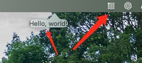
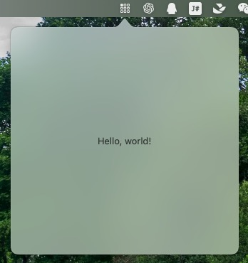

# Tray
A macOS tray app helper library. Support both **SwiftUI** and **AppKit**.

## Install
Open **XCode**, then **File** -> **Add Package Dependencies...**, on the new window, copy `https://github.com/boybeak/Tray.git` and paste it to search input.

## Usage
Import `Tray` before use it.
```swift
import Tray
```
Then, on your `AppDelegate` class, declare a class variable `private let tray = Tray()`. Then set arguments to the tray in `applicationDidFinishLaunching`, after that, install it.
```swift
class AppDelegate: NSObject, NSApplicationDelegate {
    
    private let tray: Tray!
    
    func applicationDidFinishLaunching(_ notification: Notification) {
        tray = Tray.install(named: "TrayIcon") { tray in 
            // config Tray here
            // 1. setView
            tray.setView(content: ContentView()) 
            // tray.setView(view: ) or tray.setView(viewController: )
            // Some other optional parameters:
            // - behavior: NSPopover behavior, default is .transient;
            // - level: NSPopover window level, default is .floating;
            // - size: Size of NSPopover, default is nil, depends on the view you passed in.

            // 2. If you do not need a view, you can set a left click event
            tray.setOnLeftClick(onClick: {
                self.onNewNoteAction()
                return true // return true, If you handled event and prevent default action, the default action is show popover view if you set.
            })

            // 3. And also you can set a right click evnet
            tray.setOnRightClick(onClick: {
                return true // return true, If you handled event and prevent default action, the default action is show menu if you set.
            })

            // 4. If you need a menu for right click.
            let menu = NSMenu()
        
            let newNoteMenuItem = NSMenuItem(title: NSLocalizedString("Menu_item_new_note", comment: ""), action: #selector(onNewNoteAction), keyEquivalent: "")
            let quitMenuItem = NSMenuItem(title: NSLocalizedString("Menu_item_quit", comment: ""), action: #selector(onQuitAction), keyEquivalent: "")
            
            menu.addItem(newNoteMenuItem)
            menu.addItem(quitMenuItem)
            tray.setMenu(menu: menu)

        }
    }
    
    @objc func onQuitAction() {
        NSApplication.shared.terminate(nil)
    }
}
```

## Suggestions

### 1. Tray icon size
The tray icon size: 18\*18 for 1x, 36\*36 for 2x and 54\*54 for 3x.

### 2. Work with SwiftUI
If you are using SwiftUI, you can init AppDelegate like below:
```swift
@main
struct MyApp: App {
    @NSApplicationDelegateAdaptor(AppDelegate.self) var app: AppDelegate

    var body: some Scene {
        Settings {}
    }
}
```
The code `Settings {}` will hide main window if your app is a tray only app.

#### 2.1 Anchor triangle is not in the middle of the window?

If you are using swiftUI, you'd better both set size in tray and swiftUI's view.
```swift
// Tray install
Tray.install(content: ContentView(), size: CGSize(width: 320, height: 320))
```
```swift
struct ContentView: View {
    var body: some View {
        VStack {
            Text("Hello, world!")
        }
        .frame(width: 320, height: 320)
    }
}
```
After config size, it looks normal.


### 3. Hide app's docker icon
In Info.plist add an options: **Application is agent(UIElement)** - **YES**

## More
Who use this library?
1. [Translator](https://github.com/boybeak/TranslatorDocs);
2. [JustTodo](https://github.com/boybeak/JustTodo);
3. [DeskNote](https://github.com/boybeak/DeskNote);